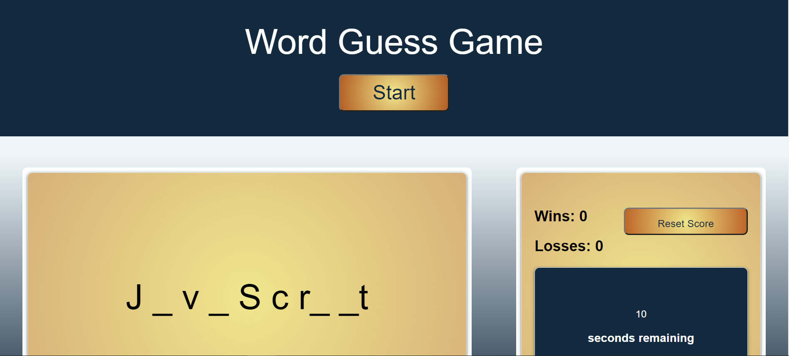

# Word-Guessing-Game

## Description:
This is a word guessing game. The words are all associated with common Javascript and computer science terms. Users guess the word by pressing letter keys. If the word includes the selected letter, the user sees where the letters occur in the word dynamically. Users have 10 seconds to guess the correct letters and word to win. The application also stores & displays a wins and losses count for each user that can be reset at anytime.

## Built With:
* HTML
* CSS
* Javascript

## Deployed Links:
* [See Live Site](https://egraham96.github.io/Word-Guessing-Game/)
* [Link to GitHub Repo](https://github.com/egraham96/Word-Guessing-Game)
                                                                                        
## Preview of Working Site:

## How to Contribute:
If you'd like to contribute to this project please send an email to eeg4@uw.edu or message me on Github: egraham96

## License:

